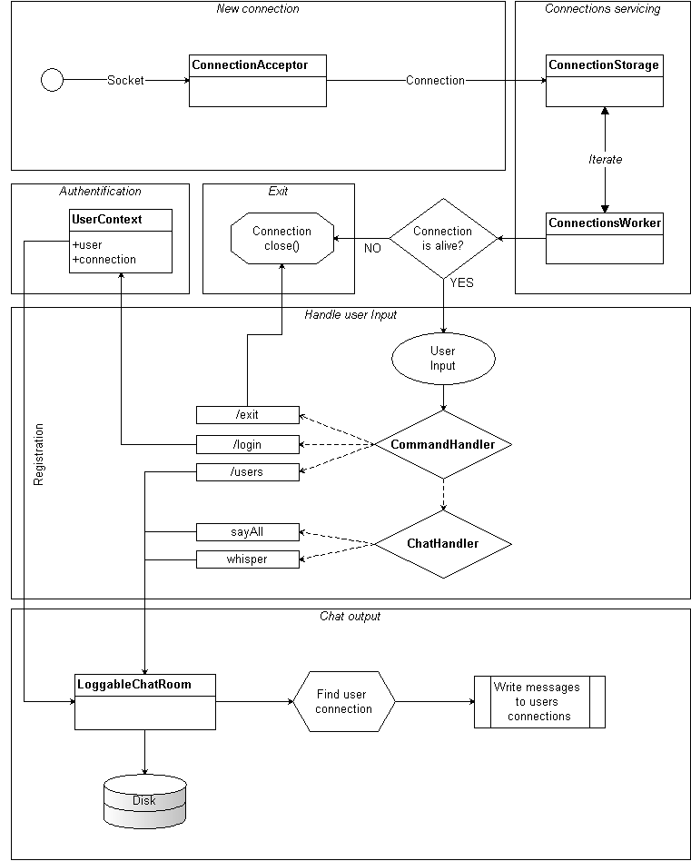

## Сетевой чат - Сервер

### Возможности

- Возможность подключиться к серверу в любой момент и присоединиться к чату.
- Выбор имени в чат-комнате с помощью команды `/login <name>`.
- Просмотр участников комнаты командой `/users`.
- Отправка сообщений всем пользователям.
- Отправка сообщения только одному пользователю с использованием команды `@<name>`.
- Обновление соединения пользователя чат-комнаты после повторного логина.
- Отключение неактивных соединений по таймауту.
- Завершение работы и разрыв соединения по команде `/exit`
- Запись всех отправленных через сервер сообщений с указанием имени пользователя и времени отправки. (`file.log`).

### Схема работы компонентов

### Особенности работы

Неблокирующее чтение данных пользовательских соединений позволило обойтись всего двумя потоками.
   - `ConnectionAcceptor` для принятия новых TCP соединений.
   - `ConnectionsWorker` для обработки ввода-вывода всех соединений.
   
Была предпринята попытка обрабатывать пользовательские соединения в пуле потоков.
Но при нескольких тысячах активных пользователей происходило резкое увеличение потребления памяти.

Неблокирующие компоненты пакета Java NIO не были использованы из за сложности реализации построчной фильтрации.

При выбранной реализации сложно определять активность соединений, поэтому выла введена проверка их активности и отключение по таймауту.

В текущем состоянии сервер обладает достаточным быстродействием для обработки всех пользователей одной чат-комнаты.

### Возможности развития

- Кодировка сообщений может быть изменена. По умолчанию выбрана UTF-8.

- Легко добавить новую пользовательскую команду в `CommandHandler` т.к. он выполнен по одноименному шаблону. Список обработчиков может быть расширен, но последним подразумевается `ChatHandler`.

- Безопасность. Пользователи могут указывать не только логин, но и пароль.

- Чат-комнат может быть несколько. Выбор комнаты возможен на этапе логина или отдельной командой.

- Вывод истории последних публичных сообщений подключившемуся пользователю.

- При хранении сообщений появится возможность отправлять их оффлайн пользователям. Адресаты получат свои данные при следующем подключении к серверу.

### Тестирование

В проекте представлены модульные тесты отдельных компонентов и интеграционный тест с тестовым клиентом.